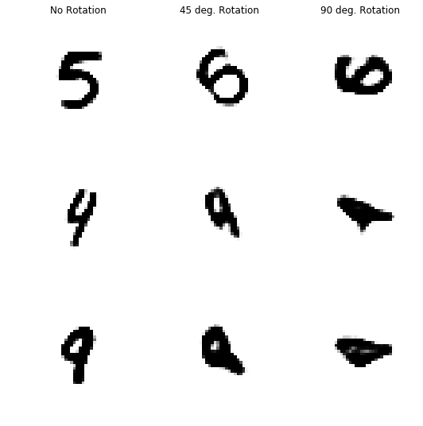
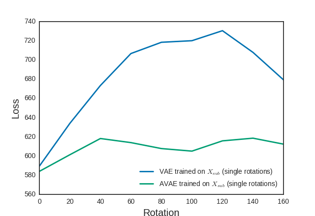
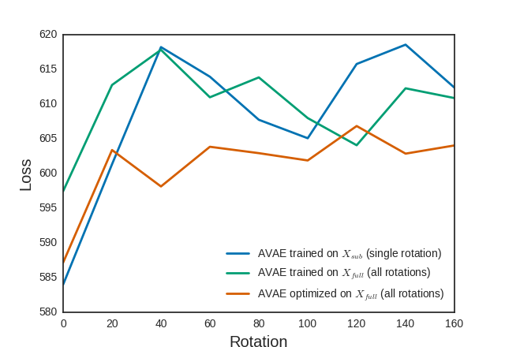

# Affine Variational Autoencoder

The Affine Variational Autoencoder (AVAE) is a variant of the Variational Autoencoder (VAE), allowing this model to generalize to affine transforms by adding affine transform layers, and optimizing the affine transform to reduce the VAE's loss. Because the VAE's loss is a lower bound of the probablilty of the sample, by optimizing this we push the input to be likely under the training distribution. For both rotations and general affine transforms on MNIST the AVAE significantly improves performance compared to VAE.

In addition, the affine transform can be optimized during training to force the model to only learn a subset of the input distribution, enabling the model to generalize to affine transforms while only encoding a small subset of all possible ones. This introduces a trade-off between model size and compute through the optimization.

---
### VAEs don't generalize to rotations, but AVAE does:
Examples of poor generalization of VAE:

Comparison of VAE and AVAE generalization over different losses:

### Training with optimzation of rotations:
Training with transformation optimization outperforms the other approaches, resulting in a smaller model that is still able to generalize to all affine transforms:

---
### Details:
More details are given [here](http://renebidart.com/2019-04-23-Affine-Variational-Autoencoders-for-Efficient-Generalization/)
* The AVAE and VAE architectures are both located in [models.py](model/models.py)
* Evaluation of rotation opimization during training is in [notebooks/optimizing_rotations.ipynb](notebooks/optimizing_rotations.ipynb)
* Evaluation of rotation opimization during training is in [optimizing_batch_rotations.ipynb](notebooks/optimizing_batch_rotations.ipynb)
* An investigation into the rotation optimization is in [check_rotation.ipynb](notebooks/check_rotation.ipynb)
